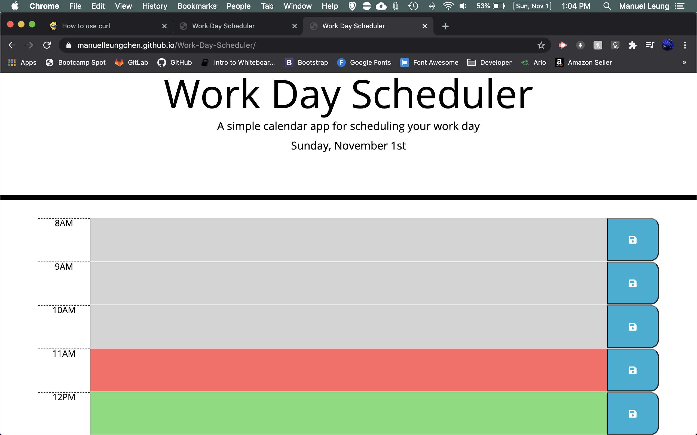

# Work Day Scheduler
Work Day Scheduler with JQuery

   

## Description
This repository **\([Work Day Scheduler](https://github.com/manuelleungchen/Work-Day-Scheduler)\)** contains a Web Application that generates work agenda that storage each hour event on local and storage and it is erased the following day. The languages use on this website are **HTML 5**, **CSS**, **Bootstrap** and **JavaScript**. **JQuery** is use to dynamically updated HTML and CSS. [Moment.js](https://momentjs.com/) is used to manipulate date and time. This source code is available to everyone under the standard [MIT license](https://github.com/manuelleungchen/Work-Day-Scheduler/blob/main/LICENSE).

## Features
* Each hour is color coded
* Events are save on local storage
* Events are cleared on the next day
* Responsive user interface



## User Story
```
AS AN employee with a busy schedule
I WANT to add important events to a daily planner
SO THAT I can manage my time effectively
```

## Acceptance Criteria
```
GIVEN I am using a daily planner to create a schedule
WHEN I open the planner
THEN the current day is displayed at the top of the calendar
WHEN I scroll down
THEN I am presented with time blocks for standard business hours
WHEN I view the time blocks for that day
THEN each time block is color-coded to indicate whether it is in the past, present, or future
WHEN I click into a time block
THEN I can enter an event
WHEN I click the save button for that time block
THEN the text for that event is saved in local storage
WHEN I refresh the page
THEN the saved events persist
```

## Instructions
1. Go to [Work Day Scheduler](https://manuelleungchen.github.io/Work-Day-Scheduler/)
2. Scroll and find a time-block
3. Type event details on textarea
4. Click on save button

## Credits
All changes and improvements were implemented by:

Manuel Leung Chen [GitHub](https://github.com/manuelleungchen)

## License
Copyright \(c\) Microsoft Corporation. All rights reserved.

Licensed under the [MIT license](https://github.com/manuelleungchen/Work-Day-Scheduler/blob/main/LICENSE).

